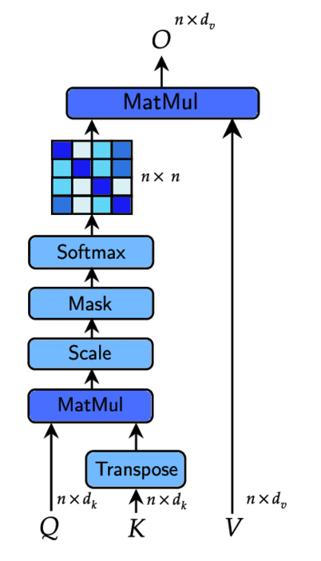
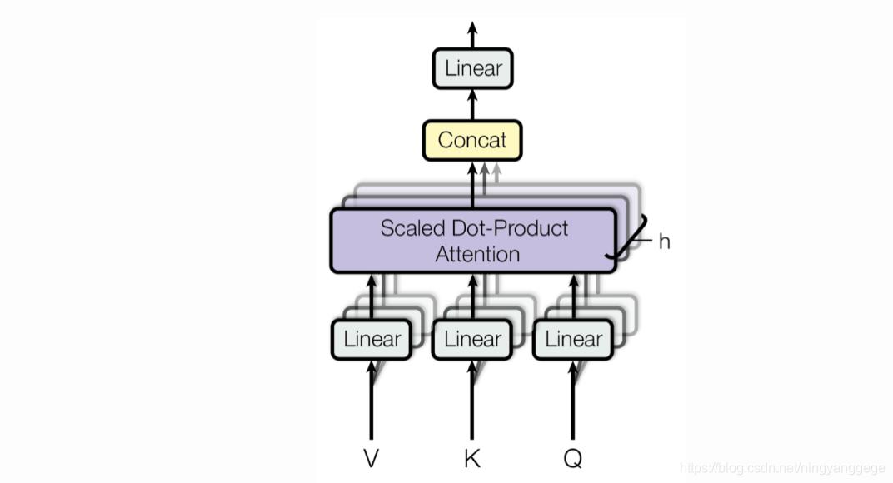
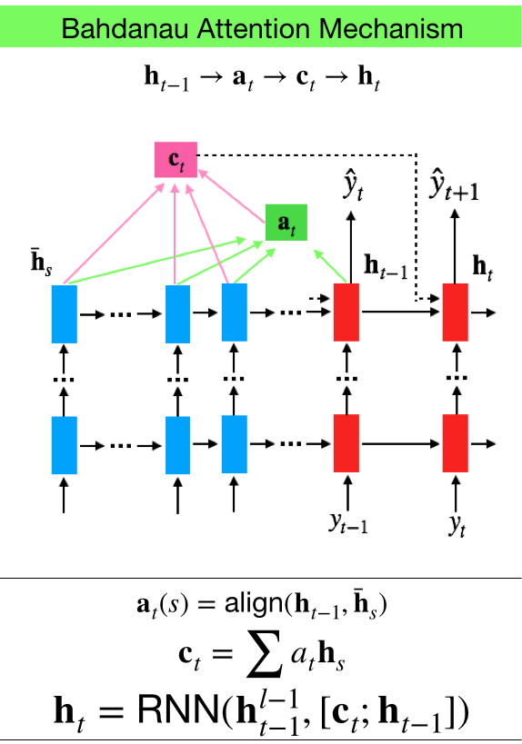
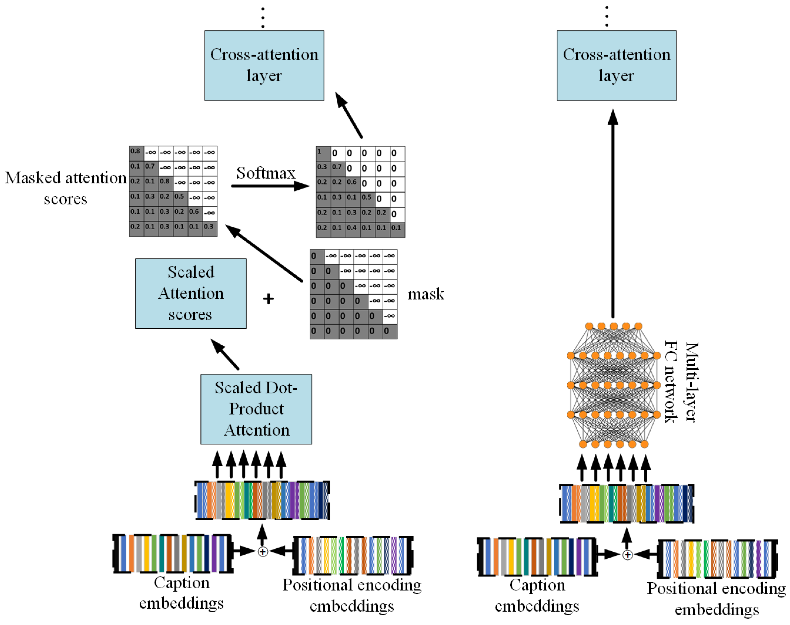
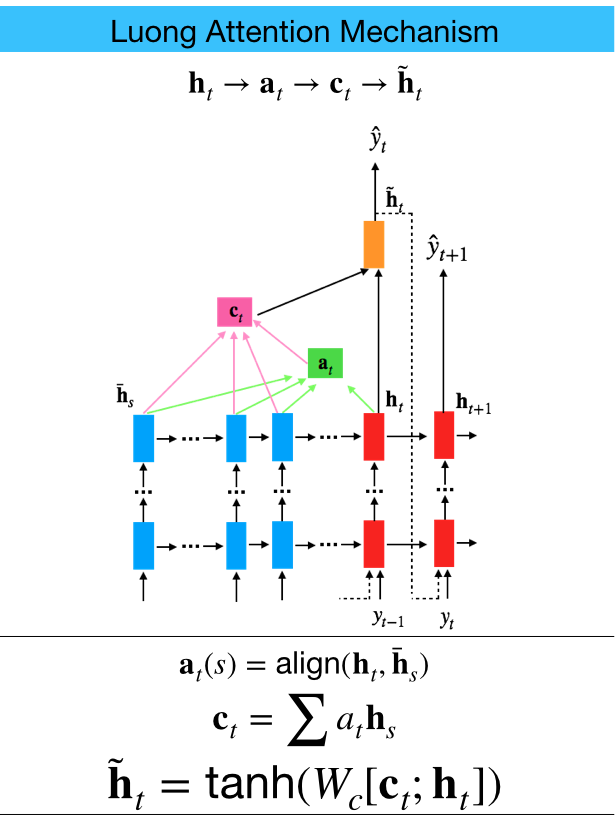

<h1 align="center">Attention Modules</h1>

### This repository contains implementations of the most popular Attention Modules.

#### Attention Modules
- [Scaled Dot-Product Attention](#scaled-dot-product-attention)
- [Multi-Head Attention](#multi-head-attention)
- [Bahdanau Attention](#bahdanau-attention)
- [Causal Attention](#causal-attention)
- [Luong Attention](#luong-attention)

### Scaled Dot-Product Attention

  

*Scaled Dot-Product Attention* is a mechanism that computes attention scores by taking the dot product between queries and keys, scaling the result by the square root of the key dimension, and applying a softmax function to obtain the attention weights. These weights are then used to compute a weighted sum of the values.

The *Scaled Dot-Product Attention* is widely used in Transformer models like BERT, GPT, and ViT (Vision Transformers).

### Multi-Head Attention

  

*Multi-Head Attention* is an extension of scaled dot-product attention, where multiple attention heads are used in parallel to learn different representations of the input. Each head independently applies scaled dot-product attention, and their outputs are concatenated and linearly transformed.

### Bahdanau Attention

  

*Bahdanau Attention* was one of the first attention mechanisms designed to improve neural machine translation by allowing the model to focus on relevant parts of the input sequence dynamically.

*Bahdanau Attention* is primarily used in sequence-to-sequence models, especially in early neural machine translation models like the original sequence-to-sequence with attention.

### Causal Attention

  

*Causal Attention*, also known as masked attention, ensures that each position in the output sequence can only attend to previous positions and itself, preventing information from future positions from influencing the current position.

This type of attention is very popular in Generative Pretrained Transformers (GPT models), where the output sequence is generated step by step.

### Luong Attention

  

*Luong Attention*, introduced by Thang Luong, is another type of attention mechanism used to improve machine translation models by aligning source and target sequences. It comes in several forms, such as dot, general, and concat.

It is primarily used in sequence-to-sequence models that require alignment between input and output sequences.
